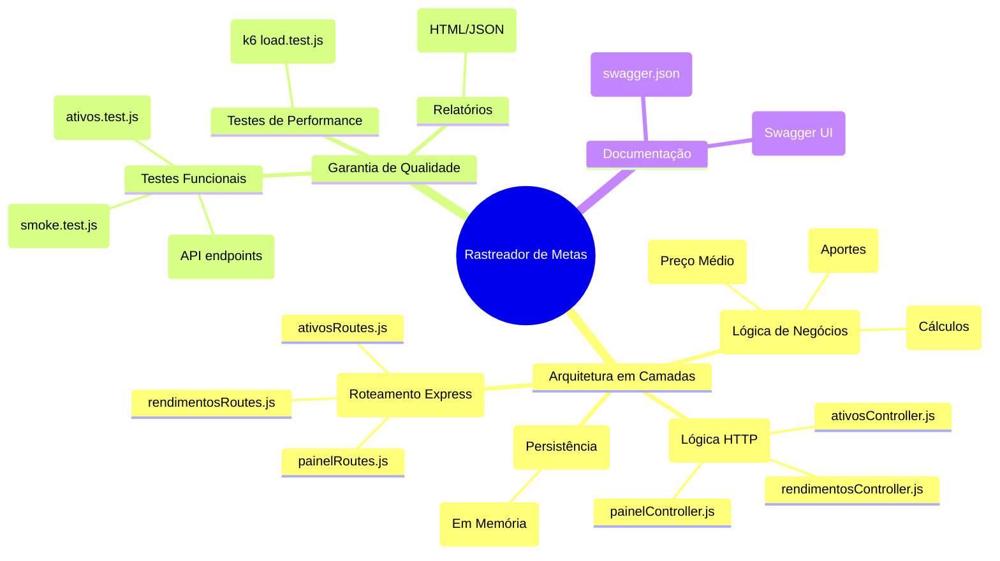

# Rastreador Simples de Metas e Aportes - API REST

Esta é uma API REST desenvolvida em Node.js com Express para atuar como um Rastreador Simples de Metas e Aportes. A API gerencia o cadastro de ativos/categorias, registra aportes e rendimentos mensais, e gera relatórios consolidados de rentabilidade de forma automatizada no painel.

---

##  Arquitetura do Projeto

O projeto segue uma arquitetura em camadas estruturada para promover separação de conceitos, facilidade de manutenção e testabilidade:

- **`src/models/`**: Camada de persistência em memória. Define as coleções de dados (ativos e rendimentos/aportes) e os métodos auxiliares de leitura e gravação.
- **`src/services/`**: Camada de lógica de negócios. Realiza as validações e calcula os indicadores consolidados do painel (Total Investido, Rendimento Acumulado, Total Acumulado e Percentual de Rendimento).
- **`src/controllers/`**: Camada de controle. Intermedeia as chamadas HTTP e a lógica de negócios, controlando os códigos de status HTTP e formatação de respostas e erros.
- **`src/routes/`**: Camada de roteamento. Define os endpoints do servidor e direciona as requisições para seus respectivos controllers.
- **`src/resources/`**: Contém arquivos de configuração estática e recursos do projeto (como a especificação do Swagger JSON).

###  Mapa Mental da Estrutura

Abaixo está o mapa mental que ilustra como o projeto está estruturado entre componentes da aplicação, qualidade e documentação:



---

##  Tecnologias Utilizadas

- **Runtime**: Node.js
- **Framework Web**: Express.js
- **Documentação**: Swagger UI Express
- **Configurações adicionais**: CORS middleware

---

##  Como Executar o Projeto

1. Certifique-se de ter o **Node.js** instalado em sua máquina.
2. No diretório raiz do projeto, instale as dependências:
   ```bash
   npm install
   ```
3. Inicie o servidor:
   ```bash
   npm start
   ```
4. O servidor iniciará por padrão na porta `3000`. Acesse:
   - API: `http://localhost:3000`
   - Documentação Swagger: `http://localhost:3000/api-docs` ou `http://localhost:3000/swagger`

---

##  Endpoints da API

A documentação interativa completa dos endpoints e seus modelos de erro (status code 400, 500) e sucesso está descrita no Swagger. Abaixo, um resumo rápido dos endpoints disponíveis:

### 1. Ativos (`/api/ativos`)
- **`POST /api/ativos`**: Cadastra um ativo ou categoria. Se o ativo já existir (mesmo código), adiciona a quantidade e calcula o novo preço médio ponderado automaticamente.
  - **Payload Exemplo**:
    ```json
    {
      "codigo": "MXRF11",
      "nome": "Maxi Renda FII",
      "quantidade": 100,
      "precoMedio": 10.50
    }
    ```
- **`GET /api/ativos`**: Lista todos os ativos ou categorias cadastradas no banco de dados em memória.

### 2. Rendimentos e Aportes (`/api/rendimentos`)
- **`POST /api/rendimentos`**: Registra uma entrada mensal. O campo `tipo` aceita apenas `"rendimento"` ou `"aporte"`. O campo `mes` deve seguir o padrão `AAAA-MM`.
  - **Payload Exemplo**:
    ```json
    {
      "mes": "2026-08",
      "tipo": "rendimento",
      "valor": 150.00
    }
    ```
- **`GET /api/rendimentos`**: Lista todas as entradas e rendimentos registrados.

### 3. Painel (`/api/painel`)
- **`GET /api/painel`**: Retorna os cálculos automáticos consolidados:
  - **Total Investido**: `Soma de (quantidade * precoMedio)` de todos os ativos.
  - **Total Rendimentos**: `Soma de todos os valores` onde `tipo === "rendimento"`.
  - **Total Aportes**: `Soma de todos os valores` onde `tipo === "aporte"`.
  - **Total Acumulado**: `Total Investido + Total Rendimentos`.
  - **Porcentagem de Rendimento**: `(Total Rendimentos / Total Investido) * 100`.
  - **Resposta Exemplo**:
    ```json
    {
      "totalInvestido": 1050.00,
      "totalRendimentos": 150.00,
      "totalAportes": 500.00,
      "totalAcumulado": 1200.00,
      "porcentagemRendimento": 14.29
    }
    ```

---

##  Testes Automatizados e de Performance

A aplicação conta com uma estratégia de garantia de qualidade (QA) robusta, dividida em quatro camadas de testes para validar a API sob diferentes perspectivas:

### 1. Testes Unitários
- **O que são**: Testes que validam pequenas unidades isoladas de código, como funções e regras de validação sem envolver requisições de rede.
- **Importância**: Garantem que as fórmulas matemáticas (como o recálculo do preço médio ponderado no `ativosService.js`) funcionem perfeitamente em todas as condições possíveis de entrada de dados.
- **Como executar**:
  ```bash
  npm run test:unit
  ```

### 2. Testes de Integração (API)
- **O que são**: Testes de ponta a ponta que simulam requisições HTTP reais contra a nossa API (usando `Supertest` e `Mocha`), passando pelas rotas, controllers, services e persistência.
- **Importância**: Garantem que o contrato dos endpoints esteja correto (validação de payloads, códigos de status HTTP como `200 OK`, `201 Created` e `400 Bad Request` e mensagens de erro de validação).
- **Relatório Mochawesome**: A execução gera um relatório web interativo contendo os resultados e gráficos de execução.
- **Como executar**:
  ```bash
  npm run test:api
  ```
  *O relatório gerado é salvo localmente em `mochawesome-report/api/api-tests.html` e publicado automaticamente na nuvem em: [https://Eduh06.github.io/portfolio/](https://Eduh06.github.io/portfolio/)*

### 3. Testes de Fumaça (Smoke Tests)
- **O que são**: Testes simples e rápidos que validam se a infraestrutura básica e a acessibilidade da aplicação estão operacionais.
- **Importância**: Funcionam como um termômetro rápido. Garantem que o servidor Express inicializa corretamente, redireciona rotas críticas e serve a documentação do Swagger UI (`/api-docs`).
- **Como executar**:
  ```bash
  npm run test:smoke
  ```

### 4. Testes de Performance (Carga)
- **O que são**: Simulações de tráfego de acesso concorrente à API utilizando a ferramenta de alta performance **k6** (Grafana).
- **Importância**: Certificam que o servidor continua rápido (tempo de resposta médio abaixo de 200ms) e estável (menos de 1% de falhas) sob acessos simultâneos de usuários virtuais (VUs).
- **Pré-requisitos**: Requer a instalação do k6 na máquina ([Instruções em k6.io](https://k6.io/)).
- **Como executar**:
  ```bash
  npm run test:perf
  ```
  *O relatório de performance em HTML é gerado em `mochawesome-report/api/performance.html` e publicado automaticamente na nuvem em: [https://Eduh06.github.io/portfolio/performance.html](https://Eduh06.github.io/portfolio/performance.html)*

---

##  Como rodar todos os testes funcionais de uma vez
Para executar sequencialmente as suites de testes unitários, testes de API e testes de fumaça, basta rodar:
```bash
npm test
```

*Nota: Para assegurar que cada teste de API rode de forma isolada, a base de dados em memória é redefinida para seu estado inicial antes de cada cenário de teste através do helper `databaseSnapshot.js`.*


