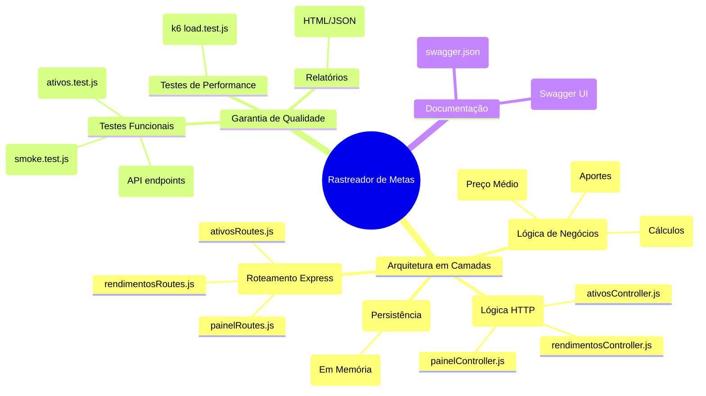

# 01. Visão da API

A API do **Rastreador Simples de Metas e Aportes** concentra as regras de negócio e persistência de dados em memória para controle patrimonial e cálculo de rentabilidade.

### Responsabilidades da API:
- Cadastro de ativos ou categorias (com consolidação de preço médio ponderado para códigos duplicados).
- Listagem dos ativos em carteira.
- Lançamento mensal de aportes e rendimentos (dividendos/proventos).
- Listagem de histórico de movimentações financeiras.
- Consolidação automática de métricas do painel (Total Investido, Rendimentos, Aportes, Total Acumulado e Porcentagem de Retorno).
- Documentação interativa e automatizada com Swagger.

---

### 🗺️ Mapa Mental da Estrutura

Abaixo está o mapa mental que ilustra como o projeto está estruturado entre componentes da aplicação, qualidade e documentação:



---

### Endpoint Base Local
Toda a comunicação com a API em ambiente local de testes é feita a partir de:
```text
http://localhost:3000
```
